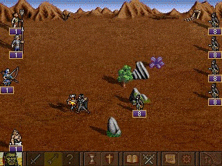

# Palm Pocket Heroes
This project tries to bring good old Palm Heroes/Pocket Heroes back to life. The work has been started in 2017.



## What we have
### Sources of different versions
1. <https://github.com/sigman78/pocketheroes/> &mdash; Seems to be at least 1.04. Maybe it's like 1.04-pre-release. Can't be compiled because of `Before proceeding, ensure you have: * Visual-studio compiler with WinMobile support * WTL library installed`.
1. <https://sourceforge.net/projects/palmheroes/> &mdash; Seems to be at least 1.03. Can't be compiled because of lack of some files. Also, there is many code that is related to licence registration (take a look at commits.

So the sources are old. Let's primarily use the 1.04-pre-release version.

### Change logs
To fix the old sources and upgrade the version to 1.05.
 
* [0.02, 0.03, 0.041](http://hpc.ru/soft/software.phtml?id=9712).
* [1.01, 1.03](http://hpc.ru/soft/software.phtml?id=18685).
* [1.04, 1.05](https://4pda.ru/forum/index.php?showtopic=104972).

### File prefixes
Prefix|Possible description
---|---
gxl|Main framework
xxl|Extensions for the main framework
xau|Audio compression
xjp|Image compression
he|"Helium" library

### Menus
Menu classes|Description|Menu items
---|---|---
`MenuView`/`iMainMenuDlg`|Main menu screen|`TRID_MENU_NEWGAME`, `TRID_MENU_LOADGAME`, `TRID_MENU_HIGHSCORE`, `TRID_MENU_CREDITS`, `TRID_MENU_EXITGAME`
`GameMenuDlg`/`iGameMenuDlg`|Small menu dialog in the corner of the screen during the game|Settings, Save game, Main menu, Quit, Return to game

## What we do
Port the existing sources to Kotlin and Java. Use [LibGDX](https://github.com/libgdx/libgdx) to draw picture and provide binaries for different platforms.

The progress can be seen under the [Issues](https://github.com/anonymous-frog-studio/pph/issues) tab.

There are some practices of rewriting C++ code to JVM-related code:

### Constant references
To archive this, it's needed to write an interface with constant methods and another interface or class with other classes that extends/implements the constant interface. See an example [here](https://github.com/anonymous-frog-studio/pph/blob/master/core/src/main/kotlin/com/github/servb/pph/gxlib/gxlmetrics/Point.kt).

Maybe in the future everything will be rewrited as immutable.

### Remove super classes
* `iIListNode`.
* `TypeAware`.

### Use standard Kotlin/Java classes
Kotlin or Java class|Initial type
---|---
`String`|`_T("String content")`
`String`|`L"String content"`
`String`|`LPCTSTR`
`Byte`|`sint8`
`UByte`|`uint8`
`Short`|`sint16`
`UShort`|`uint16`
`Int`|`sint32`
`UInt`|`uint32`
`Long`|`sint64`
`ULong`|`uint64`

### Code folding
IDEs such as IDEA or NetBeans can fold code. It's useful to hide huge pieces of code by default:
```html
//<editor-fold defaultstate="collapsed" desc="hashCode & equals">
custom hashCode and equals methods here
//</editor-fold>
``` 

## Other links
* Pocket Heroes aka Palm Heroes history &mdash; <http://wiki.ioupg.com/doku.php/ioupgteam:pocket_heroes>. Has some info about the game resources compression.
* Group with fans of Palm Kingdoms, the descendant game &mdash; <https://vk.com/palmkingdoms>.
* Obsolete and archived repo &mdash; <https://github.com/anonymous-frog-studio/new-ph-legacy>.
